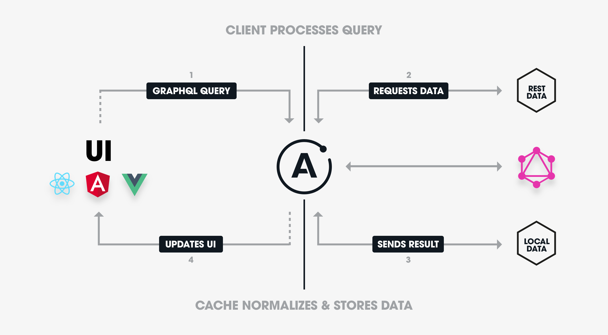

# Server-side architecture: GraphQL and Apollo Server.



GraphQL server project that implements:
- Authentication
- Authorization
- Data access layer with a database
- Domain specific entities such as users and messages
- Different pagination strategies
- Real-time abilities due to subscriptions.

## Additional Spec:
- Testing with Mocha & Chai
- Batching and Caching with Data Loader

## Working with Postgres:
- After installing Postgres on your local machine.
    ```
    // Postgress CML
    $ psql -U postgres
    
    // Test Command
    $ SELECT * from users;
    $ SELECT text from messages;
    ```
## Deploying on Heroku
```
// Create the heroku application
$ heroku create graphql-server-node-js

// Create DB on free tier and add the DATABASE_URL to config.
$ heroku addons:create heroku-postgresql:hobby-dev
```
 
- Visit the url extended by **/graphql** to access the playground.